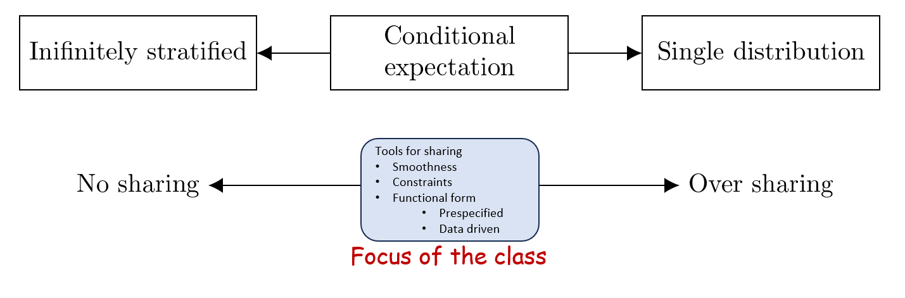
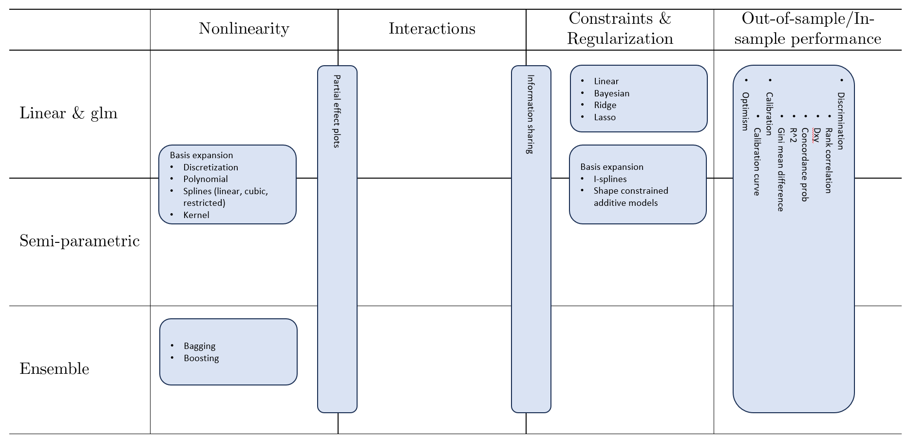

# Machine Learning I Fall 2024

## Big Ideas

This course is organized around a few big ideas.

1. Model building is inherently an exercise in structured information sharing

2. Linear model ≠ Linear relationships
3. Constraints = Information
4. Variability in data → Variability in models → Variability in predictions and inference

## Topical learning objectives

* Construct glm, semi-parametric, and ensemble models which 
    * answer research questions
    * allow for nonlinearity
    * incorporation interactions
* Calculate in-sample and out-of-sample measures of performance
    * Describe the relationships between model complexity, stability, and generalizability 
* Assess model fit
* Visualize the relationships implied by the various models
* Implement different types of regularization/constraints
    * PCA, L1, L2, Bayesian

## Professional learning objectives

* Use reproducible reporting tools (notebooks, markdown, etc)
* Use Github
* Author comprehensive reports and associated manuscripts which
    * Translate the research question to analytic methods
        * Identify simplifying assumptions and consequences
    * Describe data collection, provenance, and processing
    * Include consort diagram
    * Include standard summaries of population/data (Table 1)
    * Include publication-ready figures and tables
* Prepare oral or poster presentations which are tailored to the intended audience

## Instructional approach

Among other things, 

* This is a **writing** course.  Nearly every assignment and class period will involve a writing component.
* This is a **self-directed** course.  Students are encouraged to identify and pursue topics of personal interest related to the learning objectives.
* This is a **reading** course.  Students are expected to pursue topics of personal interest by finding and reading scholarly texts.
* This is a **get-your-hands-dirty** course.  Students are expected to demonstrate ideas and tools with reproducible examples and simulations.
* This is a **public speaking** course.  Students are expected to present to the class regularly.

## Cadence

Generally, each module will be assigned at the end of class on Tuesday.  On Thursdays, class will begin with student presentations on initial explorations of the topic, usually with simple examples and applications.  Then, the instructor will lecture.  On Tuesdays, students will present on the topic in greater detail and rigor, possibly including self-directed (but related) topics.

| | Thursday | Tuesday |
|:---|:---:|:---:|
| First half | Initial explorations (less formal) |  Student presentations (more formal) |
| Second half | Lecture | Student presentations (more formal) |

## Final projects

Students will plan, execute, and present a data analysis on a question of your their own choosing, preferably a question from their own research. Students will answer the research question using the tools of the class. Students are encouraged to

1. Choose a research question for which the development of a predictive model makes sense.
2. Select a dataset that includes predictors of various types (both continuous and categorical).
3. Incorporate methods discussed in the course. (For example, transformations, splines, missing data methods, bootstrap, etc.)
4. Address model selection and fit.
5. Use graphical displays in both the report and the presentation.

The final exam period is Monday, December 16, 2024 from 9AM to noon.  During the exam period, students will present their analysis to the class, giving particular emphasis to the strengths and weaknesses of their approach.

## Evaluation

Final grades will be a weighted average of the final project (30%), initial explorations (30%), and student presentations (40%).

| Grade | Score |
|---|---|
| A | [90, 100] |
| B | [80, 90) |
| C | [70, 80) |
| F | Otherwise |

## Modules

| Name | A | B |
|:---|:---|:---|
| Left hand side of the equation | [(link)](https://github.com/thomasgstewart/machine-learning-1-fall-2024/blob/main/modules/01a-left-hand-side-of-equation.md) | [(link)](https://github.com/thomasgstewart/machine-learning-1-fall-2024/blob/main/modules/01b-left-hand-side-of-equation.md) | 
| Hazards model |  [(link)](https://github.com/thomasgstewart/machine-learning-1-fall-2024/blob/main/modules/02a-hazards-models.md) | |

## Schedule

| Mon | Tue | Wed | Thu | Fri |
|:---|:---|:---|:---|:---|
| Aug &nbsp; |27 &nbsp; |  | 29 Left-hand side &nbsp; |   |
| Sep &nbsp; |3 DUE: [Left-hand side (part b)](https://github.com/thomasgstewart/machine-learning-1-fall-2024/blob/main/modules/01b-left-hand-side-of-equation.md) &nbsp; |  | 5 &nbsp; |   |
| |10 Add deadline &nbsp; |11 Drop deadline &nbsp;  | 12 &nbsp; |   |
| |17 &nbsp; |  | 19 &nbsp; |   |
| |24 &nbsp; |  | 26 &nbsp; |   |
| Oct &nbsp;| 1 &nbsp; |  | 3 &nbsp; |   |
| | 8 &nbsp; |  | 10 &nbsp; |   |
| | 15 Fall reading day No class |  | 17 &nbsp; |   |
| | 22 Drop (with W) deadline |  | 24 &nbsp; |   |
| | 29 &nbsp; |  | 31 Nevada Day &nbsp; |Nov &nbsp;|
| | 5 Election day No class |  | 7 &nbsp; |   |
| | 12 &nbsp; |  | 14 &nbsp; |   |
| | 19 &nbsp; |  | 21 &nbsp; |   |
| | 26 Thanksgiving No class |  | 28 Thanksgiving No class |   |
|Dec &nbsp; | 3 &nbsp; |  | 5 Last day of class |   |
| | 10 &nbsp; |  | 12 &nbsp; |   |
| 16 FINAL EXAM&nbsp; | |  |  |   |

## Instructor

[Thomas G. Stewart, PhD](https://datascience.virginia.edu/people/thomas-stewart)  
Associate Professor  
<i class="fas fa-map-marker-alt"></i> 1919 Ivy Rm 348  
<i class="fas fa-envelope"></i> thomas.stewart@virginia.edu  
<i class="fab fa-github-square"></i> thomasgstewart

## Instruction & Office hours <i class="fas fa-chalkboard-teacher"></i>

**Format of the class:** In-class time will be a combination of lectures, group assignments, live coding, and student presentations.  

**Please note:** Circumstances may require the face-to-face portion of the class to be online.

**Time:** Tuesday and Thursday @ 11am - Data Science Building Rm 246

**Office Hours:** TBD on first day of class.

## Textbooks <i class="fas fa-book"></i>

Advanced Linear Modeling  
by Ronald Christensen  
[(link)](https://link.springer.com/book/10.1007/978-3-030-29164-8)

Plane Answers to Complex Questions: The Theory of Linear Models  
by Ronald Christensen  
Available as a PDF via UVA institutional license [(link)](https://link.springer.com/book/10.1007/978-3-030-32097-3)

Regression Modeling Strategies With Applications to Linear Models, Logistic and Ordinal Regression, and Survival Analysis  
by Frank E. Harrell, Jr.  
ISBN-13: 978-3-319-19424-0  
Available as a PDF via UVA institutional license [(link)](https://doi.org/10.1007/978-3-319-19425-7)  
Author's website for textbook: [(link)](http://hbiostat.org/rmsc/)

### Optional reference texts 

Data Analysis Using Regression and Multilevel/Hierarchical Models  
by Andrew Gelman and Jennifer Hill  
ISBN-10: 052168689X  
ISBN-13: 978-0521686891

## Computing

The course will be taught using  [R (link)](https://www.R-project.org/).

## Communication

To be discussed on first day of class.

## Adjustments

The instructor may alter the course content and grading policies during the semester.

## Collaborative learning

Students are encouraged to study together.  The instructions for each deliverable will indicate if and how students may work together on the deliverable.
Students should not collaborate on the final project.  Students that violate the collaborative-work policy on an deliverable will fail the deliverable in
question and forfeit the opportunity to retake or resubmit.  Students that violate the collaborative-work policy on the final exam will fail the final exam.
Students may be refered to UVA Honor Committee.

## Accomodations

UVA is committed to creating a learning environment that meets the needs of its diverse student body. If you anticipate or experience any barriers to learning in this course, please feel welcome to discuss your concerns with me. If you have a disability, or think you may have a disability, you may also want to meet with the Student Disability Access Center (SDAC), to request an official accommodation. You can find more information about SDAC, including how to apply online, through their website at www.studenthealth.virginia.edu/SDAC. If you have already been approved for accommodations through SDAC, please make sure to send me your accommodation letter and meet with me so we can develop an implementation plan together.
